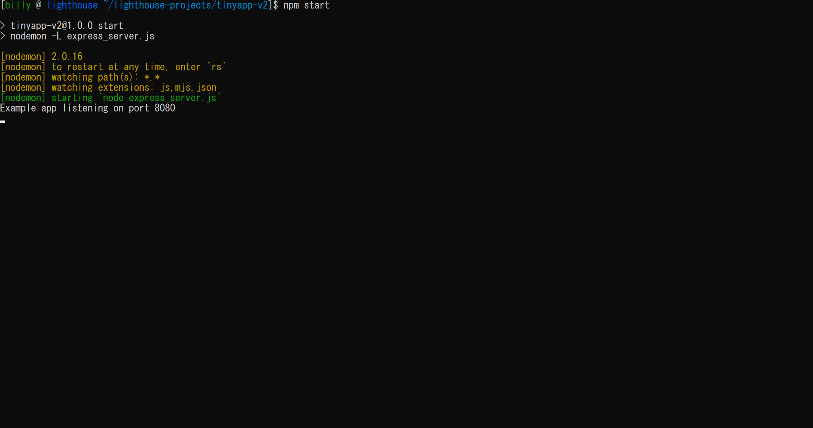
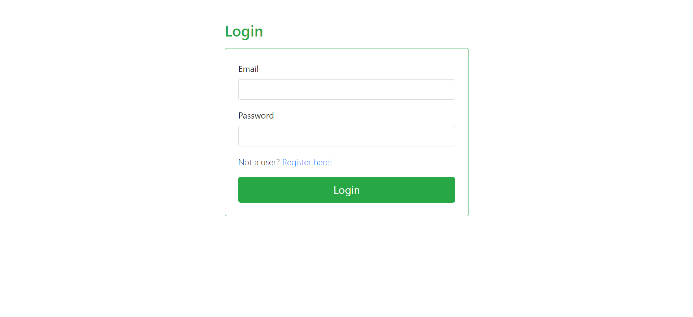
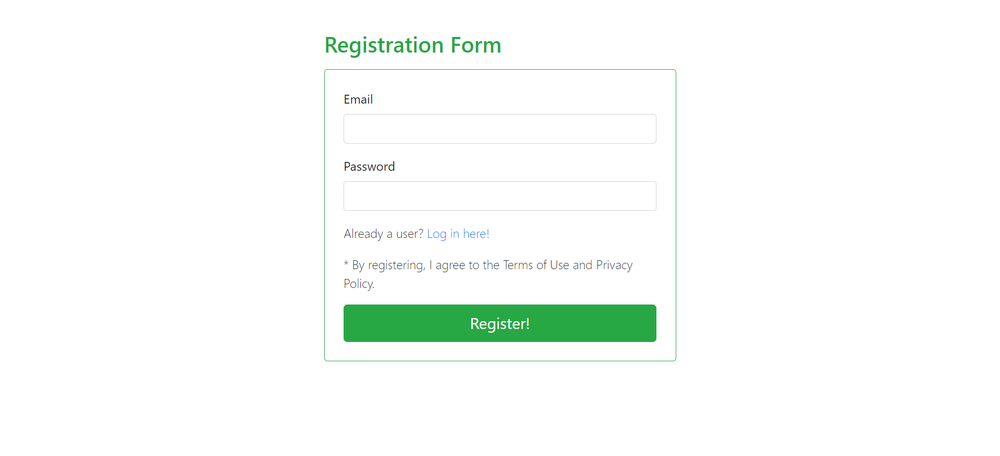
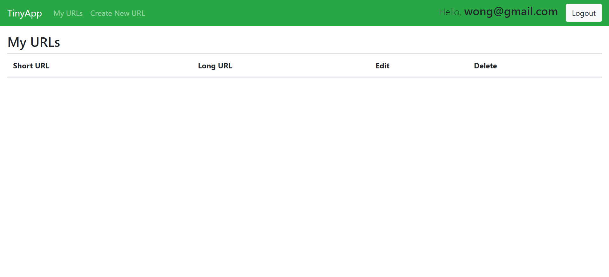
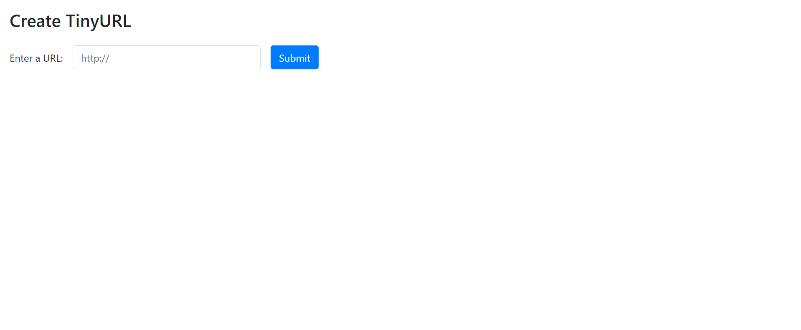
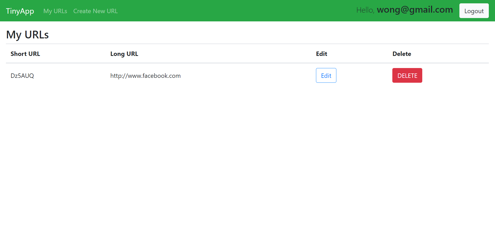

# tinyapp

A web application that is written with Node.js and Express.js to allow users to shorten long URLs.

## Getting started

1. clone this repo `git@github.com:bwong-yh/tinyapp.git`
2. nagivate to tinyapp dir
3. enter `npm install` to install necessary modules

## How to use

4. enter `npm start` to initiate server
   
5. open broswer and enter `localhost:8080` to prompt to log in page (if not logged in)
6. enter email and password if you are registered OR click the link to register
   
   

7. once logged in, it will prompt you the the homepage
   
8. click on `Create New URL` to nagivate to create page
   
9. Once new URL is added, you will be prompt back to the homepage to view / modify the URL
   
10. enter `CTRL + c` or `⌘ + c` to end server (whenever you want)

## Dependencies

- node.js
- express.js
- ejs
- body-parser
- cookie-session
- bcrypt
- method-override
- date-fns
- mocha (for testing)
- chai (for testing)
